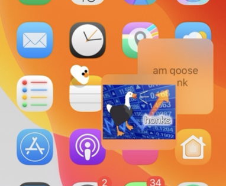

# MobileGoose

MobileGoose is an iOS tweak based on [Desktop Goose by Sam Chiet](https://samperson.itch.io/desktop-goose). It creates a goose on your screen that runs around, blocks you from typing by walking on your keyboard and brings you memes and notes.

## Featured on

- [EverythingApplePro - iOS 13.3 Jailbreak & Best Tweaks! iPhone 11/11 Pro!](https://youtu.be/G7-jiu-S3yw?t=302)
- [TheTechSpot - There's a GOOSE on My iPhone! \(MobileGoose Meme Tweak Review\)](https://youtu.be/4mJEUCCt0D0)
- [Tools4Hack - MobileGoose -「いたずらガチョウ」が画面を歩き回って、マジうざい](https://tools4hack.santalab.me/jbapp-com-pixelomer-mobilegoose.html)